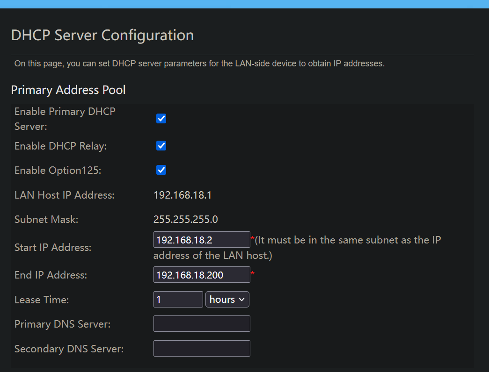

# Manual setup

The goal is to have as little manual setup as required but as we're working with raspberry pis or other pyhsical hardware there will always be some level of manual overhead.

For us we only have 3 manual steps.

## Flashing SD card

There is a great guide [here](https://www.raspberrypi.com/documentation/computers/getting-started.html) for flashing your SD card and installing the correct OS.

## Connecting to the internet

After you have flashed your SD card you will boot up your system and ensure you have a connection to the local internet.

## Create private key

`
In order for us to connect seurly to our hosts without user:password we need to create a private key

```bash
ssh-keygen -t ed25519 -C "ansible-control-node" -f ~/.ssh/ansible_key
```

Once this is created ensure you have the hosts and user set in the `001-distribute_ssh_keys.yaml` playbook

```yaml
---
- name: Distribute SSH Keys to Hosts
  hosts: localhost
  gather_facts: yes
  vars:
    ansible_key_path: "~/.ssh/ansible_key.pub"
    ansible_user: "pi"
    target_hosts:
      - 192.168.18.7
```

When running this playbook you will be asked to ensure the password at runtime. This is ideal for this initial one time setup.

```bash
ansible-playbook ./ansible/playbooks/001-distribute_ssh_keys.yaml
```

### Wifi Ip range

As we're using MetalLB we need to set boundries for our local internet in the route settings. We have updated the end IP to 192.168.18.200

